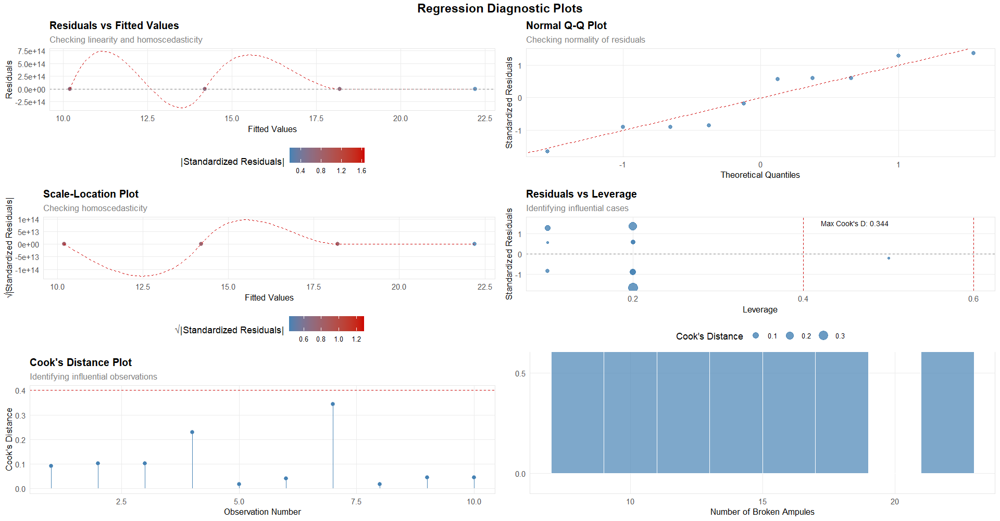

# portfolio
Data Analysis Projects | Fall 2025

This repository showcases a collection of data-driven projects focusing on exploratory data analysis (EDA), statistical modeling, and predictive analytics. Through these projects, I seek to demonstrate proficiency in applying both classical statistical methods and modern data science techniques to extract insights from datasets.

## Featured Projects:
### Glass Ampule Breakage Data Analysis
This analysis implements  regression techniques to model the relationship between transportation handling and product integrity in supply chains. Key technical highlights include:

1. Statistical Computing Using R
2. Advanced Data Visualization with ggplot2
3. Linear Regression & Diagnostic Graph Analysis
4. Statistical Inferences & Interval Building

#### Glass Ampule Breakage Diagnostics

