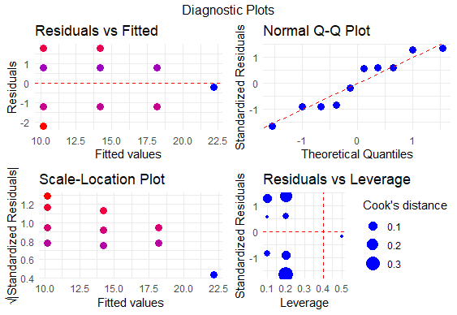

# portfolio
Advanced Analytics & Exploratory Data Analysis Projects | Fall 2025

This repository showcases a collection of data-driven projects focusing on exploratory data analysis (EDA), statistical modeling, and predictive analytics. Through these projects, I seek to demonstrate proficiency in applying both classical statistical methods and modern data science techniques to extract insights from datasets.

## Featured Projects:
### Glass Ampule Breakage Data Analysis
This analysis implements  regression techniques to model the relationship between transportation handling and product integrity in supply chains. Key technical highlights include:

1. R Statistical Computing 
2. ggplot2 Data Visualization   
3. Linear Regression & Diagnostic Analysis
4. Statistical Inference

